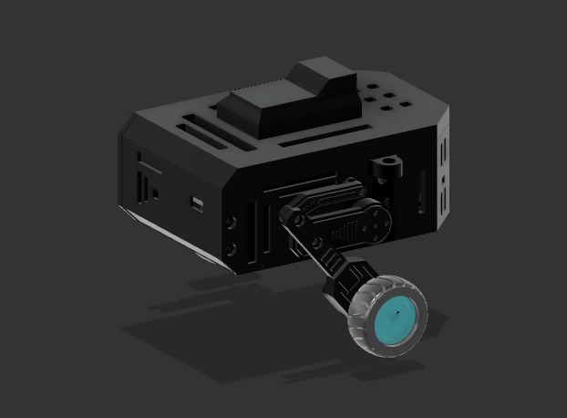

# penguin

><b>P</b>erception-<b>E</b>nabled <b>N</b>avigation and <b>G</b>eneral-<b>U</b>tility <b>IN</b>telligence

Hybrid differential legged-wheeled biped rover for embodied AI, computer vision, and autonomous navigation.

 ### Status
>- Controller manufactured and partially assembled.
>- Soldering and hardware validation in progress.
>- Mechanical components currently being printed.

<strong>Table of Contents</strong>

- [penguin](#penguin)
    - [Status](#status)
  - [Overview](#overview)
  - [Features](#features)
  - [Architecture](#architecture)
  - [Hardware](#hardware)
  - [Firmware](#firmware)
  - [Repository Structure](#repository-structure)
  - [Gallery](#gallery)

I built penguin cause I wanted to create an intelligent robot from the ground up. 

<table>
  <tr>
    <td width="50%">
      
    </td>
    <td width="50%">
      
    </td>
  </tr>
  <tr>
    <td width="50%">
      
    </td>
    <td width="50%">
      
    </td>
  </tr>
</table>

## Overview

## Features 

## Architecture 

## Hardware 

## Firmware

## Repository Structure 

## Gallery 

---
Jeevan Sanchez, 2026