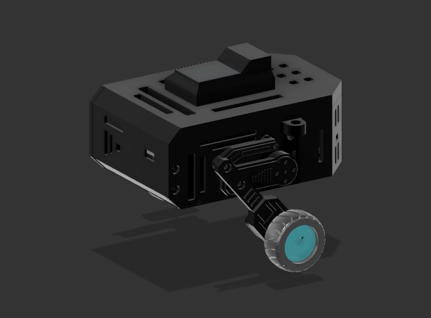

# penguin

> <b>P</b>erception-<b>E</b>nabled <b>N</b>avigation and <b>G</b>eneral-<b>U</b>tility <b>IN</b>telligence

Hybrid differential legged-wheeled biped rover for embodied AI, computer vision, and autonomous navigation.

### Status

> - Controller manufactured and partially assembled.
> - Soldering and hardware validation in progress.
> - Mechanical components currently being printed.

<details>`
<summary><strong>Table of Contents</strong></summary>

- [penguin](#penguin)
    - [Status](#status)
  - [Overview](#overview)
  - [Features](#features)
    - [Controller](#controller)
    - [Mechanical](#mechanical)
  - [Architecture](#architecture)
    - [Systems](#systems)
  - [Electrical](#electrical)
    - [Power System](#power-system)
    - [Microcontroller](#microcontroller)
    - [Motor Drivers](#motor-drivers)
    - [Vision Interface](#vision-interface)
    - [Sensor and I2C Interface](#sensor-and-i2c-interface)
    - [Bugs](#bugs)
  - [Mechanical](#mechanical-1)
    - [Chassis](#chassis)
    - [Leg Assembly](#leg-assembly)
  - [Firmware](#firmware)
    - [Architecture](#architecture-1)
    - [Drivers](#drivers)
    - [Engine](#engine)
      - [State \& System Definitions](#state--system-definitions)
      - [Controllers \& Locomotion](#controllers--locomotion)
      - [Behaviour](#behaviour)
    - [Networking](#networking)
    - [GUI](#gui)
  - [Gallery](#gallery)

</details>

I built penguin cause I wanted to create an intelligent robot from the ground up.

<table>
  <tr>
    <td width="50%">
      
    </td>
    <td width="50%">
      
    </td>
  </tr>
  <tr>
    <td width="50%">
      
    </td>
    <td width="50%">
      
    </td>
  </tr>
    <tr>
    <td width="50%">
      
    </td>
    <td width="50%">
      
    </td>
  </tr>
</table>

## Overview

Put simply, Penguin is a platform for experimentation with intelligent robotics.

The project began as a simpler, maze-solving rover for a course project (MREN 178 - DSA). My team couldn't deliver the rover in time
so we scaled down. I had already started with hardware, which pushed me to adopt the project into my own, with the intent to expand it past maze-solving.

After that term (Winter '26), I designed a controller PCB and the necessary compoments for the chassis.

Now its September, and I'm tuning PID.

## Features

### Controller

The controller is powered by a 7.4V LiPo Battery and driven by an ESP32-S3 (N16 1U).

Below is a list of features from power circuits to various peripherals.

- Power-entry circuitry with OC/OV protetction, RPP, PI-filter, and dual-mosfet BMS.
- Regulation circuit featuring buck converter, 5V ORing, and LDO for logic power (3V3)
- ESP32-S3 breakout circuitry with USB differential routing, S3 boot mode selection and reset toggle.
- Controlled power delivery via CMOS circuits for main motor power.
- N20 motors with encoders for wheels driven by a DRV8833 chip.
- DS3218 20kg Servo motors for hip joints, driven by PWM signals from S3.
- OV2640 camera with FPC connector and three-level voltage regulation.
- I2C bus with three ToF sensors, OLED screen, and GPIO expander.
- Audible and visual indicators.
- cool silkscreen penguin.

### Mechanical

- Three-layer internal stackup for housing motors, controller board, and routing cables.
- Integrated vents and ports for sensors and devices, air flow, and weight reduction.
- Hybrid locomotion system with wheels and legs.
- Multi-bar leg assembly - pivot arm, mounting arm (hip), leg.

## Architecture

### Systems

## Electrical

This section provides low-level explanations of the significant circuits of each "module" of the controller.

I encourage you to clone the repo or you use [KiCanvas](https://kicanvas.org/) to look at the schematic and board files.

All electronics were designed with **KiCad**.

### Power System

**Power Entry**

<p align="center">
  
</p>

The 7.4V battery power enters through a Molex Micro-Fit (3mm Pitch) header, where it is then met with a 12V 7A fuse for over-current protection. A PTC resettable fuse was selected for durability.

The positive battery line is then protected from voltage spikes with a Transient Voltage Supression (TVS) diode placed in paralell for clamping.

- The diode's standoff @ `9V`
- Breakdown @ `10V`
- Clamps @ `15.4V`

The positive line then goes through a Reverse Polarity Protection (RPP) circuit, using a P-Channel MOSFET for lossless efficiency (lower V drop than standard diodes).

A Zener diode and resistor is placed between the MOSFET's gate and source for gate over-voltage protection.

A bulk electrolytic (100μF) capacitor, ferrite bead, and high-frequency (0.1μF) capacitor are then placed to create a third-order low pass filter (π-filter).

- This is used to smooth voltage spikes and reduce EMI.

The ferrite bead was primariy selected for its saturation current and DCR.

The approximate current draw with safety margin $I_{net}$ is 5A.

$I_{\mathrm{sat}} = 1.5 \times I_{\mathrm{net}} \approx 10 A$

Minimize heat dissipation.

$DCR$ is 10Ω

$P_{heat} = DCR \times I_{\mathrm{sat}} \approx 0.25 W$

**Battery-Management-System (BMS)**

<p align="center">
  
</p>

The BMS system uses the negative terminal of the battery and features a `HY2120` protection IC with a dual-mosfet to form the system's **GND**.

The IC uses the balance tap of the battery (VC ~ 3.7V nominal) to monitor the level of Cell 1, while using the main positive terminal (VDD ~ 7.4V nominal) to monitor Cell 2.

This allows the IC to indepdently track each cell's voltage and trigger the dual-MOSFET to cut off power if either cell suffers from overcharge or overdischarge.

**Voltage Regulation (I)**

<p align="center">
  
</p>

The controller uses a cascade regulation system, starting with the `TPS5405DR` buck converter.

The input voltage is `VBATT` (7.4V), after the protection and filtering circuitry, and the output is 5V.

The $R_{osc}$ value will determine the switching frequency of the converter.

Switching frequency is governed by the relationship.
$$R_{\text{OSC}} (\text{k}\Omega) = 21.82 \cdot f_{\text{SW}}^{-1.167}$$

I chose a value of `100kΩ` for a $f_{SW}$ of approximately `271 kHz`

For the soft-start capacitor $C_{ss}$ , I chose a value of `10nF` for a soft-start time of `5ms`

The values below were taken from the [TPS5405DR Datasheet](https://www.ti.com/lit/gpn/tps5405)

$$
C_{SS} = \frac{t_{SS} \cdot I_{SS}}{V_{REF}}
$$

$$
C_{SS} = \frac{(5\,\mathrm{ms})(2\,\mathrm{\mu A})}{0.8\,\mathrm{V}}
= 12.5\,\mathrm{nF}
\approx 10\,\mathrm{nF}
$$

The inductor values were chosen using the equation below.

$$
L=\frac{V_{out}\left(V_{in}-V_{out}\right)}
{V_{in}f_{sw}\Delta I_L}
$$

Using our calculated $f_{sw}$ from above and our voltage requirements (8.4V in, 5V out):

$$
L=
\frac{(5\,\mathrm{V})(8.4\,\mathrm{V}-5\,\mathrm{V})}
{(8.4\,\mathrm{V})(525\,\mathrm{kHz})(0.3\,\mathrm{A})}

\approx
10\,\mathrm{\mu H}
$$

The Schottky diode is rated for the `2A` output current and `8.4V`

**5V ORing**

<p align="center">
  
</p>

The `5V` rails from both USB and the buck converter are combined using an OR-ing circuit (Dual Ideal Diodes) to prevent backfeeding before feeding the second stage of regulation.

In this configuration, the outputs of both `LM66100` ideal diode controllers are tied together to form the shared `5V` rail. The `CE` pins of each device are also tied to the output rail, ensuring both controllers are only enabled once the rail is present

**Voltage Regulation (II)**

<p align="center">
  
</p>

The second stage of voltage regulation involes a Low-Dropout Regulator (LDO), the `AMS1117`

It is fed the combined `5V` rail from the OR-ing circuit to produce the controller's logic-level voltage: `3V3`

**Controlled Motor Power Delivery**

<p align="center">
  
</p>

The power for the N20 and Servo motors is controlled using a complementary-MOSFET (CMOS) setup, driven by a digital `HIGH` from the S3.

- When the control signal is low or floating, the N-channel MOSFET remains off and a pull-up resistor holds the gate of the P-channel MOSFET at the supply voltage, keeping it disabled and disconnecting the load rail.

- When the control signal is driven high, the N-channel MOSFET turns on and pulls the P-channel gate low, creating sufficient gate-source voltage to enable conduction and connect the supply to the load.

This controlled power line, `VMOT = 7.4V` powers the supply voltage of the `DRV8833` chip, and is converted via local buck converter to produce `VSERVO = 5V`

**Voltage Sensing**

A resistor divider circuit is used to produce a signal to be read by the S3's internal ADC.

- $R_1 = 100\,\mathrm{k\Omega}$
- $V_{batt} = 7.4\,\mathrm{V}$
- $V_{out} = 2.8\,\mathrm{V}$

$$
R_2 = \frac{R_1 \cdot V_{out}}{V_{batt} - V_{out}}
$$

$$
R_2 = \frac{100\,000 \cdot 2.8}{7.4 - 2.8}
= 50\,\mathrm{k\Omega}
\approx 47\,\mathrm{k\Omega}
$$

### Microcontroller

The controller is driven by an ESP32-S3-WROOM-1U-N16 microcontroller.

The `U` and `N16` model was selected for layout flexibility and memory capacity (16MB).

A `MCP23017` GPIO expander was used to accomodate space for all digital inputs/outputs (via `I2C`)

**Digital IO**

<p align="center">
  
</p>

**Mode Select and Reset Toggle**

<p align="center">
  
</p>

The S3 can be put into **BOOT** mode and **RESET** with onboard buttons.

**BOOT** mode determines whether the chip runs existing code from flash memory or waits to download new firmware.

- The ESP32 samples the **BOOT** pin (`GPIO0`) during reset to determine the boot mode.
- It is **active-low**: when pulled to **GND** during reset, the chip enters UART bootloader mode for flashing firmware.
- The circuit uses a momentary push-button to **GND** and a `10kΩ` pull-up resistor to ensure a defined high state during normal operation.

| BOOT0 Level | Boot Mode        |
| ----------- | ---------------- |
| HIGH        | Programming Mode |
| LOW         | Memory Mode      |

**RESET** controls the Enable (EN) pin which is the ON/OFF (reset) switch for the ESP32.

- It is **active-low**: when pulled to **GND** it turns off the chip, and when released, it restarts.
- The circuit consists of a momentary push-button, a pull-up resistor to ensure the chip is enabled by default, and a `1µF` capacitor to filter out button noise.

### Motor Drivers

The `N20` wheel hub motors are driven by a `DRV8833` chip, and their encoder signals are routed to digital pins on the `S3`.

They are connected via 6-Pin Molex Nano-Fit (2.50mm Pitch) headers, and feature decoupling across the motor terminals and on the encoder power supply.

<p align="center">
  
</p>

The **Servo** hip motors are driven by PWM signals from the `S3`, and are connected by a single 4-Pin Molex Nano-Fit header.

The connector has decoupling on the power supply, and series resistors on the signal lines to improve signal integrity and reduce noise.

<p align="center">
  
</p>

### Vision Interface

The controller interfaces with an `OV2640` camera via FPC-connector.

The camera is configured in **8-bit** mode using adjacent digital pins for frames.

<p align="center">
  
</p>

Power supply is divided into three levels:

- `DVDD`: **1.2V**
- `AVDD`: **2.8V**
- `DOVDD`: **3.3V**

These conversions are acheived through the use of fixed-output-voltage LDOs (`LP5907MFX`) with local decoupling.

Series low-resistance resistors were added on the camera's clock signals (PCLK, XCLK) in series for signal integrity and EMI reduction.

- I used only `S3` pins, not expander pins, for the data pins `D2-D9` and `HREF`, `VSYNC` pins.

### Sensor and I2C Interface

The controller interfaces with three `VL53L0X` Time-of-Flight (ToF) sensors for ranging (obstacle detection, SLAM - potentially).

This interface is achieved through `I2C`.

The sensors are connected through a single 7-Pin Molex Nano-Fit header, connecting the sensor power, I2C clock and data signals, and the shutdown `XSHUT` pins of each sensor.

Decoupling capacitors and shutdown pull-ups are placed locally.

<p align="center">
  
</p>

**Additional I2C Devices**

- IMU (LSM6DSL)
- Mini OLED Screen
- OV2640 Cam

**Indicator Components**

- RGB LED
- Passive LEDs for simple indication
- Buzzer for audible indication

### Bugs

- Misoriented cam header -- fixed with an extenison board + B-Type FPC cable
- DRV8833 VM and VINT pins missing GND connection
- Buzzer and RGB LED pins need clock signal but wired to MCP pins.

## Mechanical

This section provides insight on the mechanical components of Penguin: the chassis and leg assembly.

In no way am I a CAD-expert, so this was definitely a learning experience with lots of iteration.

Projected geomtery was clutch.

I used Fusion360 to design everything.

### Chassis

The chassis consists of several components attatched with pegs and magnets.

<p align="center">
  
</p>

**Base Plate**

The base plate forms the start of the internal stack-up.

It contains Servo pads for the hip motors to rest on, a port for an ON/OFF switch, and a battery slot with vents.

It acts as the "floor" of the Servo bay and the bottom of the chassis.

It connects to the rest of the chassis through pegs to insert into the inside face of each wall, as well as the nose.

<p align="center">
  
</p>

**Side Walls**

<table><tr><td width="50%"></td><td width="50%"></td></tr></table>

The side-walls enclose the internal stack-up, and provide mounting points for several chassis components.

Mounting tabs are on the inside of each wall for board mounting.

They have cutouts for the Servo shafts, arm joints, and house components like the external antenna.
The top face has short holes for magnets that align with holes on the lid.

**Nose**

<p align="center">
  
</p>

The nose contains ports for the ToF sensors, and an OLED screen.

There is also an open face cable port connecting to the controller bay for routing.

It mounts to each walls with pegs and magnets, as well as to the base plate.

**Stern**

<p align="center">
  
</p>

The stern features a USB-port and snaps to the walls via pegs.

**Lid**

<p align="center">
  
</p>

The lid contains a magnet cutouts for mounting the camera mount, and is magnetically mounted on the top surface of the walls and nose.

**Camera Mount**

<p align="center">
  
</p>

The mount features a porthole for the OV2640 camera lens, and corresponding magnet cutouts for mating with the roof.

### Leg Assembly

<p align="center">
  
</p>

The leg assembly consists of the Servo mounting arm, pivot arm, and the wheel hub assembly.

**Mounting Arm**

<p align="center">
  
</p>

This is the contact point between the leg assembly and the hip motor, it's responsible for driving the assembly.

The Servo uses the disc-horn, and fits into a cutout on the mounting arm, and is secured in with the stock machine screw into the shaft.

The end of the arm mounts onto the wheel hub assembly using bearings on each hole, an M3 shoulder bolt, and a nut.

**Pivot Arm**

<p align="center">
  
</p>

The pivot arm maintains proper orientation for the assembly as the suspension moves up and down.

It uses the same mounting as the mounting arm (bearing, shoulder bolt, nut), and is mounted slightly higher at a 40° angle on the wheel hub assembly.

**Wheel Hub Assembly**

<p align="center">
  
</p>

This component houses the N20 motors through a cutout and U-Channel cover to secure them.

The top of the assembly contains the two mounting points for the pivot and mounting arms.

Cables are routed up the back side of it.

## Firmware

Firmware was written in `C++` using the `Arduino` framework via `PlatformIO`.

All implementations can be found in the [`firmware/src`](firmware/src) directory.

### Architecture

<p align="center">
  
</p>


The firmware design is divided into three distinct layers:

- **HAL Drivers**
  - Abstraction of interfaces with hardware components.
- **Core Engine**
  - Controllers and state definitions
- **Networking**
  - Telemetry for GUI

### Drivers

Hardware drivers are used to abstract hardware interfaces for motors and sensors.

Each driver exports a class that follows a consistent structure:

```cpp
class Driver {
  public:
    Driver(uint8_t pin);
    bool begin();
    Data read(); // return type unique to hardware
    void run();
};
```

Sensory drivers such as ToFs, IMU, and camera export reads.

Actuator drivers export runs, but the DC motor driver exports a read for the encoders.

In terms of integration, drivers are instantiated at the application level (main.cpp), and are invoked by the scheduler for telemetry, and by the locomotion engine for motor control.

### Engine

The engine layer encapsulates all state machine, control, and behavioural logic into several classes.

- State & System Definitions
  - Data types, schema for global data instance
- Controllers and Locomotion
  - PID utility class, motor control
- Behaviour
  - Motion primitives and routines

#### State & System Definitions

This section defines shapes for all system objects, including IMU, ToF, and motor data.

<details>
<summary>IMU Data Object</summary>

```cpp

struct IMUData
{
  float accX; // g
  float accY;
  float accZ;

  float gyX; // dps
  float gyY;
  float gyZ;

  float temp; // C

  Rotation angles;
};

```

</details>

This and other data types are placed in a `PenguinState` struct which acts as the global state for telemetry lookup and velocity controllers. 

Additionally, it implements a `PenguinCommands` field, which is observed by locomotion controllers and updated by mmotion primitives. 
- Commands specify desired pitch, RPM, and hip angles. 

#### Controllers & Locomotion
The locomotion layer manages the low-level **movement** of the robot. 

It is blind to routines; it doesn't know *when* to move but it knows how to adjust its motion given a command (orchestrated autonomously by the Behaviour layer). 

A utility PID class is used as the basis for locomotion controller. 

It calculates an error value as the difference between a target setpoint and a mesaured proces variable, then applies a correction based on proportional, integral, and derivative terms, to smoothly drive the controller toward its desired state. 

$$u(t) = K_p e(t) + K_i \int_{0}^{t} e(\tau) d\tau + K_d \frac{de(t)}{dt}$$

The layer defines two important controllers: 
- **Balance Controller**
  - Produces an optimal RPM based on a target pitch. 
  - Uses the IMU pitch rate as derivative term in the PID Equation. 

- **Velocity Controller**
  - Produces an optimal PWM based on a target RPM. 
  - Target RPM is split into differential-drive inputs to be fed into two distinct controllers (L, R). 
    - $$v_{\text{lr}} = v_{\text{fwd}} - v_{\text{turn}} + v_{\text{corr}}$$

The main Locomotion engine then wraps these controllers within an update method to observe the `RobotCommands` struct and adjusts accordingly. 
- Hip motors are also driven here for stance adjustment. 

#### Behaviour
The behaviour layer defines the buidling blocks of Penguin's movement: 
- Motion Primitives
  - Movement actions. 
- Routines
  - Sequences of motion primitives. 

Primitives directly update `RobotCommands`, and form key positions and stances. 

Routines are simply **sequences** of motion primitives, and are tracked using a step-counter and a non-blocking timer. 
- Transitions are smoothed using **Linear Interpolation**

The routine class exports an `update` method for switching between different routines. 

This method is used in the `Behaviour` implementation. 
- Currently it autonomously runs a default cycling routine with obstacle avoidance using the ToF sensors and reverse primitives. 

### Networking
This layer leverages an asynchronous HTTP server and Websockets for streaming data to the GUI. 

The `ESPAsyncWebServer.h` is wrapped in a class `HTTPServer` which implements `begin` and `update` methods which initializes the Websocket connection, and sends the telemetry packet. 

The firmware data packet is serialized into a JsonDocument before streaming. 

The telemetry packet contains:
- Motor Data 
  - RPM, position, running boolean
- IMU Data 
  - Pitch, roll, yaw, three-axis acceleration
- ToF Data (For each sensor)
  - Proximity in mm
  - Obstacle Detection boolean
- Battery Data
  - SOC
  - Connected boolean

The payload updates are orchestrated by the **Scheduler**

| Component | Update Frequency | Update Period (Interval) |
| :--- | :--- | :--- |
| **IMU** | 100 Hz | 10 ms |
| **Motors** | 50 Hz | 20 ms |
| **TOF Sensors** | 25 Hz | 40 ms |
| **Battery Data** | 2 Hz | 500 ms |

The live camera feed is streamed **directly** over HTTP. 

**Camera Stream**

The camera driver captures frames as JPEG images and exposes them through the controller's HTTP server at:

```text
http://<controller-ip>/stream
```

The endpoint uses a `multipart/x-mixed-replace` response with a `frame` boundary, allowing a browser to display the feed directly as an MJPEG stream. The dashboard uses this endpoint as the source of an `` element, so no additional decoding or polling loop is required on the client.

The current capture configuration is:

- `VGA` frame size (`640 x 480`)
- JPEG pixel format
- JPEG quality setting of `10`
- Two frame buffers using `CAMERA_GRAB_LATEST`
- Approximately `30 ms` delay between released frames to limit stream pressure

Each request owns its stream state and releases the camera frame buffer when the frame has been sent or the client disconnects. The camera must be initialized before the HTTP server is used; the root endpoint at `http://<controller-ip>/` returns `penguin --online` as a simple connectivity check.

### GUI
The dashboard (GUI) is developed in Next.js and is ran as a local web-app. 

It displays:
- A frame view of the live camera feed.
- Three.js & IMU driven board visualization
- Proximity data visuals 
- Spedometer view for motor data

The app simply listens to the streamed Websocket, extracts the payload, and populates the according data objects.

## Gallery

<p align="center">
  
</p>


<p align="center">
  
</p>

<p align="center">
  
</p>

<p align="center">
  
</p>


---
Jeevan Sanchez, 2026

